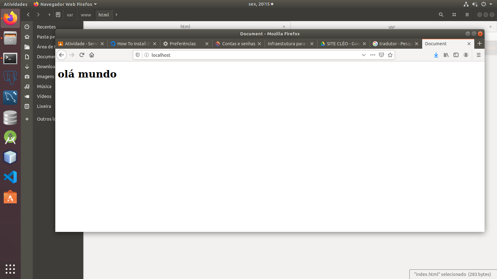

# Infraestutura para Sistemas Web
#Instação do Apache e hospedagem de Site

- 1 Passo - Instalação do Apache na maquina
insira o comando 

sudo apt istall apache2

Verifique o funcionamento
service apache status
# OK, Se aparecer uma mensagem verde escrita active (runnig), está funcionado
- Você também pode testar o apache no seu navegador - Digitando : localhost
- Se aparecer uma mensagem e imagem do apache está tudo ok

- Lista
- lista

# Para hospedar um arquivo salve seu arquivo HTML em /var/www/html

[clique aqui](link)
